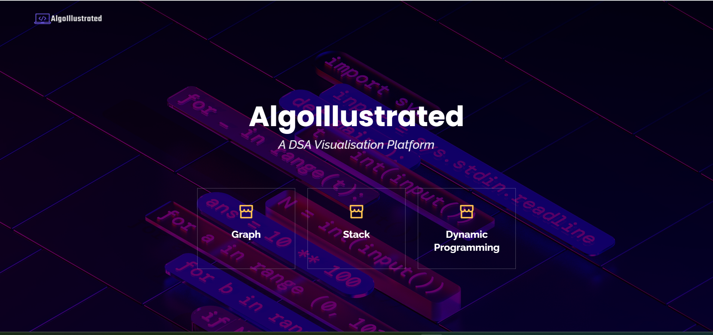
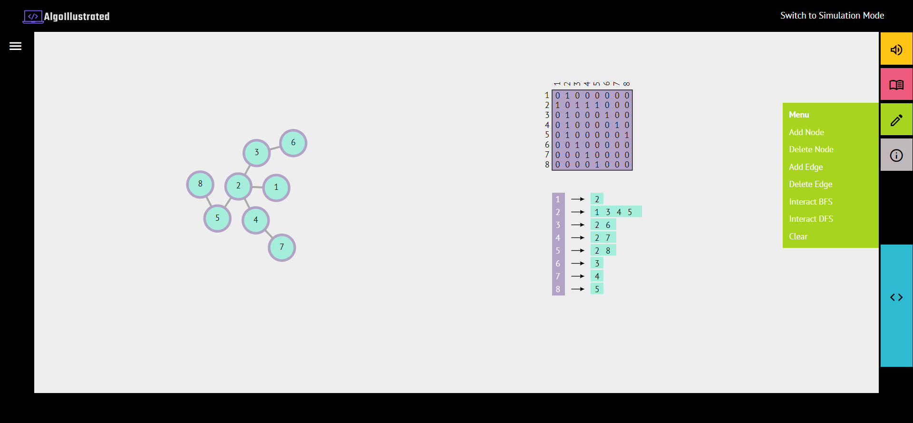
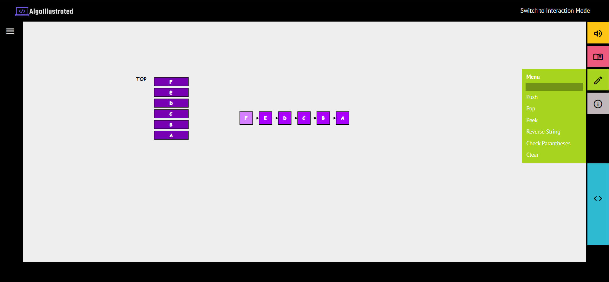
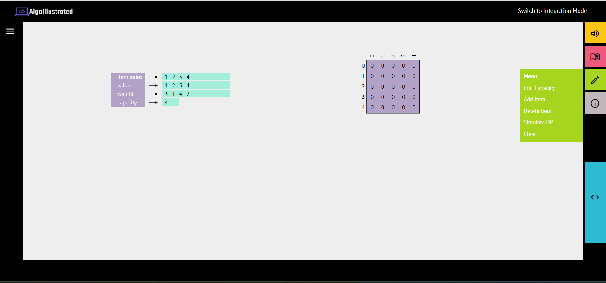

# AlgoIllustrated

## About the Project
AlgoIllustrated is a Data Structures and Algorithms Visualization Platform. It provides interactive animations and visualizations to learn and understand DSA better. There are two modes, the simulation mode, which provides animations and the interaction modes which allows users to interact with the data structures and algorithms to enhance their understanding through hand-on learning. [Link to demo video](https://drive.google.com/file/d/1f8HEqHGIfufAhYFN20wdOUkS66_UZM1v/view).

## Design Process
The development of this platform involved following the design process to understand user needs through user studies, creating lo-fi and mid-fi prototypes and evaluating the system by taking feedback from target users.
The design process is documented [here](https://drive.google.com/file/d/14Yd4kzeWH17ooxN8IOzFckfN52GFYdv_/view).

## Gallery

